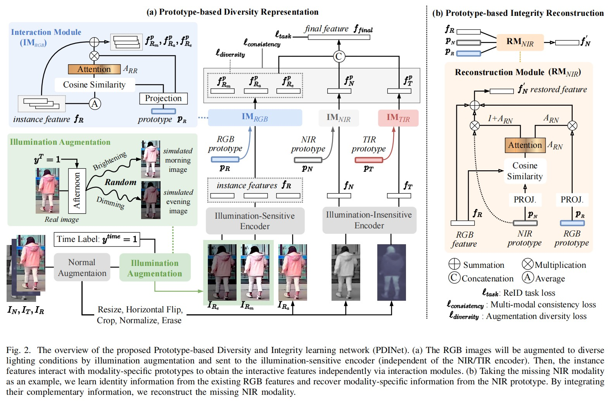
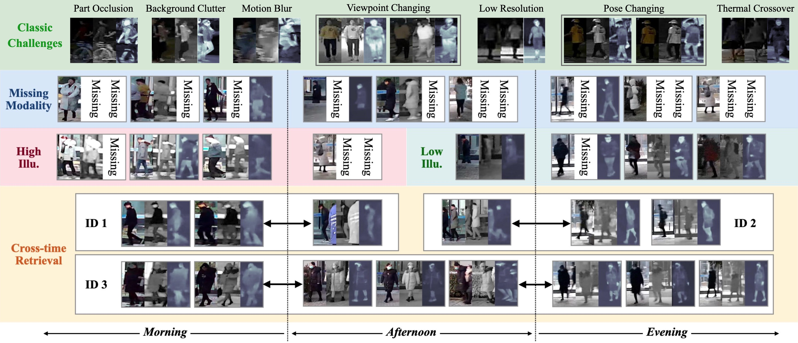
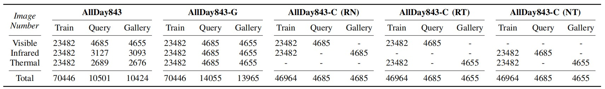
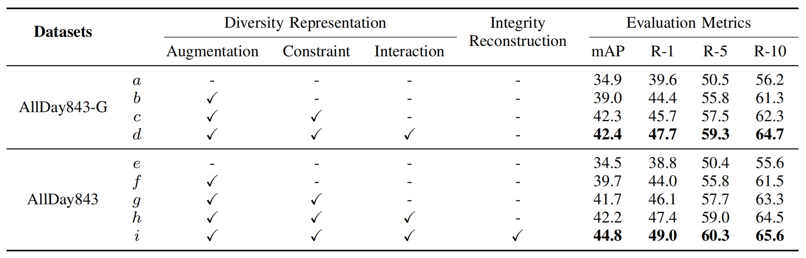
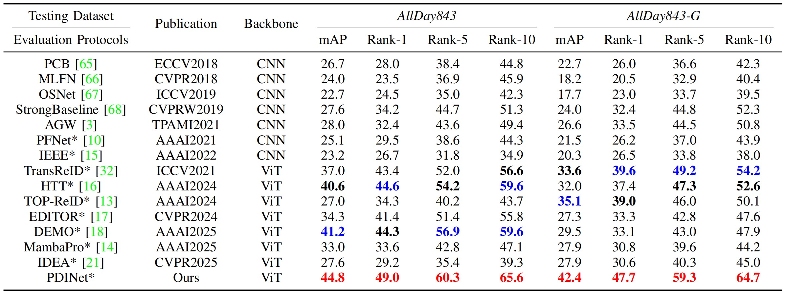

## Overview
This repository includes the implementation of PDINet [[PDF](./files/Prototype-Based_Diversity_and_Integrity_Learning_for_All-Day_Multi-Modal_Person_Re-Identification.pdf) / [Web](https://ieeexplore.ieee.org/document/11184558)] and the AllDay843 dataset, which introduces new challenges, cross-time retrieval and modality missing, for person re-identification task.

## Contributions

This work represents the pioneering effort in introducing all-day multi-modal person ReID, proposes the Prototype-based Diversity and Integrity learning network (PDINet) to address cross-time retrieval and modality-missing challenges via diversity representation and integrity reconstruction, and builds benchmark datasets closely aligns with real-world scenarios for community.

## Methods: PDINet

**Diversity Representation:** Enhances feature stability under various illumination conditions by simulating different lighting scenarios.

**Integrity Reconstruction:** Recovers missing modality data based on the relationship between available modalities and learned prototypes.

<div style="text-align: center;">
  
</div>

## Datasets: AllDay843

A large-scale, multi-modal dataset consisting of 91,371 images from 843 identities, recorded under various lighting and weather conditions throughout the day, with several derived datasets.

### Key Features

With the data collection and processing complete, AllDay843 dataset contains 91,371 images of 843 identities captured at different times from 6 viewpoints with diverse illumination, weather, and background changes. Compared with existing prevalent ReID datasets, as shown in figure, AllDay843 has the following major advantages:
- AllDay843 includes more person images aligned in three modalities and recorded by six non-overlapping cameras.
- AllDay843 includes pedestrian images from three time periods and five weather situations.
- AllDay843 involves the challenges introduced by multiple modalities and modality-missing.

<div style="text-align: center;">
  
</div>


### Settings
We further construct derived datasets based on the AllDay843 dataset. (1) We use the GAN-based Image Generation to complete the missing data and extend AllDay843 into AlIDay843-G. (2) AllDay843-C Dataset includes three cross-modal settings. These cross-modal test sets are constructed by removing the corresponding modalities from the query and gallery.

 Detailed settings of datasets:

<div style="text-align: center;">
  
</div>

### Download

Download the AllDay843, AllDay843-G and AllDay843-C from [Google Drive](https://drive.google.com/drive/folders/16kh_sIWOCqwmPs3UpsaWMyC1EMTy_dCf?usp=sharing).


## Quick Start

### Installation

```
# Clone this repository
git clone https://github.com/ziwang1121/PDINet.git
cd PDINet-master

# Install required dependencies
pip install -r requirements.txt
```

### Training

```
python train.py --config_file configs/AllDay/vit_base.yml
```


### Testing

```
python test.py --config_file configs/AllDay/vit_base.yml TEST.WEIGHT 'your_model_path'
```

### Results

Ablation study:
<div style="text-align: center;">
  
</div>


Results on AllDay843 and AllDay843-G:
<div style="text-align: center;">
  
</div>


## Citation and Contact
If this repository or dataset is helpful in your research, please cite the following paper:
```
@article{wang2025pdinet,
  title={Prototype-Based Diversity and Integrity Learning for All-Day Multi-Modal Person Re-Identification},
  author={Zi Wang, Chenglong Li, Pengyu Li, Aihua Zheng, Jin Tang, Bin Luo},
  journal={IEEE Transactions on Information Forensics and Security},
  volume={20},
  pages={11385--11400},
  year={2025},
  publisher={IEEE}
}
```

Feel free to contact with me: [ziwang1121🌀foxmail.com] or [ziwang🌀ahmu.edu.cn]